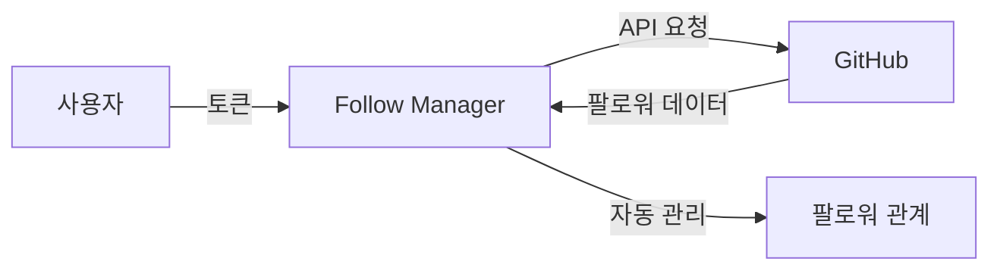
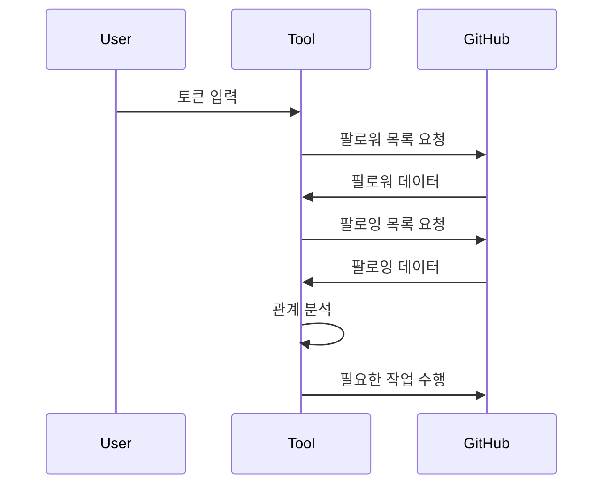

# 🤝 GitHub Follow Manager

<div align="center">

[](https://goreportcard.com/report/github.com/in-jun/github-follow-manager)

> 🔄 GitHub 팔로워/팔로잉 관계를 자동으로 관리하는 스마트 도구

</div>

---

## 📋 목차

-   [개요](#-개요)
-   [기능](#-기능)
-   [설치 방법](#-설치-방법)
-   [사용 방법](#-사용-방법)
-   [작동 방식](#-작동-방식)
-   [API 사용량](#-api-사용량)
-   [주의 사항](#-주의-사항)
-   [FAQ](#-faq)

---

## 📖 개요

효율적인 GitHub 네트워크 관리를 위한 자동화 도구입니다.



## ✨ 기능

### 핵심 기능

-   🔄 **자동 팔로우 관리**

    -   팔로워 자동 팔로우
    -   맞팔 취소 시 자동 언팔로우
    -   실시간 관계 동기화

-   🛡️ **안전한 인증**

    -   토큰 기반 인증
    -   안전한 토큰 저장
    -   권한 최소화

-   📊 **API 사용량 관리**
    -   사용량 모니터링
    -   자동 제한 관리
    -   안전한 요청 간격

### 작동 흐름도



## 🚀 설치 방법

### 1. 요구사항

| 항목        | 버전  | 설치 방법                         |
| ----------- | ----- | --------------------------------- |
| Go          | 1.16+ | [공식 사이트](https://go.dev/dl/) |
| Git         | 최신  | `apt/brew install git`            |
| GitHub 토큰 | -     | [토큰 생성 가이드](#토큰-생성)    |

### 2. 설치 과정

```bash
# 저장소 클론
git clone https://github.com/in-jun/github-follow-manager.git

# 디렉토리 이동
cd github-follow-manager

# 의존성 설치
go mod download
```

### 토큰 생성

1. GitHub 설정 → Developer settings
2. Personal access tokens → Generate new token
3. 권한 선택: `user:follow`
4. 토큰 생성 및 안전하게 보관

## 📱 사용 방법

### 기본 사용

```bash
# 프로그램 실행
go run .

# 토큰 입력 프롬프트
Enter your GitHub token: [your-token]
```

## ⚙️ 작동 방식

### 프로세스 흐름

1. **초기화**

    - 토큰 검증
    - API 연결 설정
    - 설정 파일 로드

2. **데이터 수집**

    - 팔로워 목록 조회
    - 팔로잉 목록 조회
    - 관계 분석

3. **작업 수행**
    - 필요한 팔로우 작업
    - 필요한 언팔로우 작업

## 📊 API 사용량

### 제한 사항

| 작업          | 사용량 | 시간당 제한 |
| ------------- | ------ | ----------- |
| 팔로워 조회   | 1      | 5,000       |
| 팔로잉 조회   | 1      | 5,000       |
| 팔로우 동작   | 1      | 1,000       |
| 언팔로우 동작 | 1      | 1,000       |

### 최적화 전략

-   요청 간격 조절
-   배치 처리 활용
-   캐시 사용

## ⚠️ 주의 사항

### GitHub 정책

-   API 사용량 제한 준수
-   자동화 정책 준수
-   계정 제한 주의

### 보안 고려사항

-   토큰 안전한 보관
-   최소 권한 원칙
-   주기적 토큰 갱신

## 💭 FAQ

**Q: API 사용량 제한은 어떻게 관리되나요?**

-   A: 자동으로 요청 간격을 조절하여 제한을 준수합니다.

**Q: 토큰이 노출되면 어떻게 하나요?**

-   A: 즉시 토큰을 폐기하고 새로 발급받으세요.

---

<div align="center">

**[맨 위로 올라가기](#-github-follow-manager)**

Made with ❤️ by [in-jun](https://github.com/in-jun)

</div>
